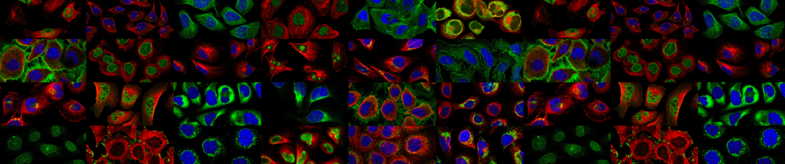

# Human Protein Atlas Image Classification

#### Task
Developing of models that capable classify mixed patterns of proteins in microscope images. 
The Human Protein Atlas will use these models to build a tool integrated with their smart-microscopy system to identify a protein's location(s) from a high-throughput image.

- Link for the competition: [Human Protein Atlas Image Classification](https://www.kaggle.com/c/human-protein-atlas-image-classification)

#### Models
- resnet18 512x512 RGB 
- resnet32 512x512 RGB  
- bninception 512x512 RGB  
Classify subcellular protein patterns in human cells
